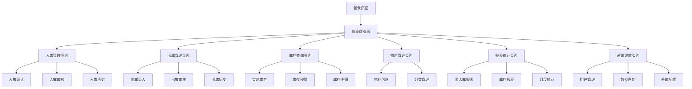

## 1. 产品概述
这是一个面向小型校服工厂的本地出入库管理系统，帮助管理布料、校服等物料的库存流转。系统完全离线运行，数据存储在本地，操作简单直观，适合技术小白使用。

目标用户：校服工厂管理人员、仓库管理员
核心价值：简化库存管理流程，提高库存准确性，降低管理成本

## 2. 核心功能

### 2.1 用户角色
| 角色 | 注册方式 | 核心权限 |
|------|----------|----------|
| 管理员 | 系统默认创建 | 所有功能权限，包括系统设置 |
| 仓库管理员 | 管理员创建 | 出入库操作、库存查询、报表查看 |
| 普通员工 | 管理员创建 | 仅可查看库存信息 |

### 2.2 功能模块
出入库管理系统包含以下核心页面：
1. **登录页面**：用户登录、密码修改
2. **仪表盘页面**：库存概览、待处理事项、快捷操作
3. **物料管理页面**：物料信息维护、分类管理
4. **入库管理页面**：入库单录入、审核、历史查询
5. **出库管理页面**：出库单录入、审核、历史查询
6. **库存查询页面**：实时库存、库存预警、库存明细
7. **报表统计页面**：出入库报表、库存报表、月度统计
8. **系统设置页面**：用户管理、系统配置、数据备份

### 2.3 页面详情
| 页面名称 | 模块名称 | 功能描述 |
|----------|----------|----------|
| 登录页面 | 用户登录 | 输入用户名密码登录系统，支持记住密码 |
| 登录页面 | 密码修改 | 用户修改登录密码 |
| 仪表盘页面 | 库存概览 | 显示总物料数、总库存量、库存金额等关键指标 |
| 仪表盘页面 | 待处理事项 | 显示待审核单据、库存预警等提醒信息 |
| 仪表盘页面 | 快捷操作 | 提供快速入库、快速出库、库存查询的快捷入口 |
| 物料管理页面 | 物料信息 | 维护物料编码、名称、规格、单位、分类等基础信息 |
| 物料管理页面 | 分类管理 | 管理物料分类，支持多级分类 |
| 物料管理页面 | 物料导入 | 支持Excel批量导入物料信息 |
| 入库管理页面 | 入库录入 | 创建入库单，录入物料、数量、价格、供应商等信息 |
| 入库管理页面 | 入库审核 | 审核入库单据，审核后更新库存 |
| 入库管理页面 | 历史查询 | 查询历史入库记录，支持按条件筛选 |
| 出库管理页面 | 出库录入 | 创建出库单，录入物料、数量、领用人等信息 |
| 出库管理页面 | 出库审核 | 审核出库单据，审核后扣减库存 |
| 出库管理页面 | 历史查询 | 查询历史出库记录，支持按条件筛选 |
| 库存查询页面 | 实时库存 | 显示当前各物料的库存数量和金额 |
| 库存查询页面 | 库存预警 | 显示库存不足或超储的物料清单 |
| 库存查询页面 | 库存明细 | 查询物料的详细库存变动记录 |
| 报表统计页面 | 出入库报表 | 统计指定时间段内的出入库数量和金额 |
| 报表统计页面 | 库存报表 | 生成库存结存报表，支持导出Excel |
| 报表统计页面 | 月度统计 | 按月统计出入库情况和库存变化趋势 |
| 系统设置页面 | 用户管理 | 管理系统用户，包括添加、修改、删除用户 |
| 系统设置页面 | 权限设置 | 设置不同角色的功能权限 |
| 系统设置页面 | 数据备份 | 手动备份数据库，支持数据导出 |
| 系统设置页面 | 系统配置 | 设置公司名称、地址、联系方式等基本信息 |

## 3. 核心流程

### 3.1 入库流程
用户登录系统 → 进入入库管理 → 点击新增入库 → 选择物料、录入数量和价格 → 保存入库单 → 管理员审核 → 库存自动更新 → 生成入库记录

### 3.2 出库流程
用户登录系统 → 进入出库管理 → 点击新增出库 → 选择物料、录入数量和领用人 → 保存出库单 → 管理员审核 → 库存自动扣减 → 生成出库记录

### 3.3 库存查询流程
用户登录系统 → 进入库存查询 → 选择查询条件 → 查看库存情况 → 可导出库存报表

## 4. 用户界面设计

### 4.1 设计风格
- **主色调**：深蓝色（#1a1a2e）搭配青色（#16213e）作为背景，营造赛博朋克氛围
- **强调色**：亮青色（#0f4c75）和橙色（#ff6b35）用于按钮和重要元素
- **字体颜色**：主要使用白色（#ffffff）和浅灰色（#b8b8b8）确保可读性
- **按钮样式**：采用扁平化设计，带有轻微的发光效果，悬停时显示霓虹灯效果
- **字体选择**：主标题使用 18px 加粗，正文使用 14px 常规，等宽字体用于数据展示
- **布局风格**：卡片式布局，带有细边框和阴影效果，网格系统排列
- **图标风格**：使用线性图标，支持SVG格式，保持简洁现代

### 4.2 页面设计概览
| 页面名称 | 模块名称 | UI元素 |
|----------|----------|--------|
| 登录页面 | 登录表单 | 居中卡片布局，深蓝色背景，霓虹灯边框效果，输入框带有发光边框 |
| 仪表盘页面 | 统计卡片 | 网格布局展示关键指标，使用渐变背景和图标，数字使用大字体显示 |
| 仪表盘页面 | 快捷操作 | 图标按钮排列，悬停时显示霓虹灯效果，点击有波纹动画 |
| 物料管理页面 | 数据表格 | 条纹行背景，排序图标，操作按钮使用图标形式，支持行内编辑 |
| 入库管理页面 | 表单录入 | 分步骤表单，必填项标记，输入验证提示，保存按钮突出显示 |
| 库存查询页面 | 查询条件 | 折叠式查询面板，条件组合选择，查询按钮使用强调色 |
| 报表统计页面 | 图表展示 | 使用图表库展示数据，支持切换图表类型，可导出功能按钮 |
| 系统设置页面 | 配置面板 | 标签页切换不同设置项，表单验证，保存确认提示 |

### 4.3 响应式设计
- **桌面优先**：主要针对1920x1080分辨率优化，支持最小1366x768
- **适配策略**：使用百分比布局和弹性盒子，确保在不同屏幕尺寸下正常显示
- **触摸优化**：按钮和交互元素保持足够大的点击区域（最小44x44像素）
- **滚动处理**：数据表格支持水平和垂直滚动，固定表头便于查看
- **窗口调整**：支持窗口大小调整，内容自动重新排列适应新尺寸