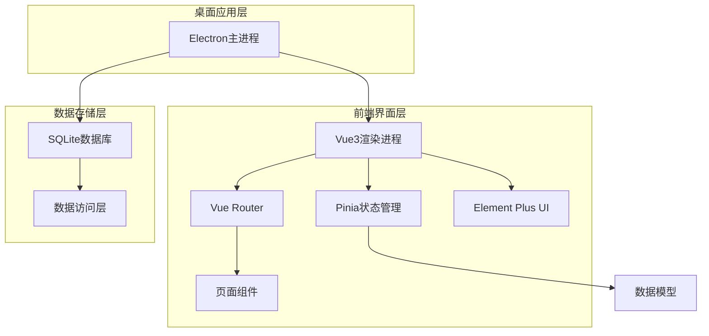

## 1. 架构设计



## 2. 技术描述

- **前端框架**: Vue3@3.3 + Vite@4.4
- **桌面框架**: Electron@25.0
- **UI组件库**: Element Plus@2.3（适配赛博朋克主题）
- **状态管理**: Pinia@2.1
- **路由管理**: Vue Router@4.2
- **数据库**: SQLite3@5.1（本地文件存储）
- **数据库管理**: Better-sqlite3@8.7（Node.js SQLite驱动）
- **打包工具**: Electron-builder@24.0
- **初始化工具**: create-vite

## 3. 路由定义

| 路由 | 用途 |
|------|------|
| /login | 用户登录页面 |
| /dashboard | 系统主仪表盘 |
| /materials | 物料管理页面 |
| /materials/category | 物料分类管理 |
| /stock/in | 入库管理页面 |
| /stock/out | 出库管理页面 |
| /stock/query | 库存查询页面 |
| /reports | 报表统计页面 |
| /settings | 系统设置页面 |
| /settings/users | 用户管理 |
| /settings/backup | 数据备份 |
| /settings/config | 系统配置 |

## 4. 数据模型定义

### 4.1 数据库实体关系图

```mermaid
erDiagram
    USERS ||--o{ STOCK_IN : creates
    USERS ||--o{ STOCK_OUT : creates
    USERS ||--o{ MATERIALS : manages
    MATERIALS }o--|| CATEGORIES : belongs_to
    STOCK_IN ||--o{ STOCK_IN_ITEMS : contains
    STOCK_OUT ||--o{ STOCK_OUT_ITEMS : contains
    MATERIALS ||--o{ STOCK_IN_ITEMS : referenced
    MATERIALS ||--o{ STOCK_OUT_ITEMS : referenced
    MATERIALS ||--o{ INVENTORY : tracked

    USERS {
        INTEGER id PK
        TEXT username UK
        TEXT password_hash
        TEXT name
        TEXT role
        TEXT email
        BOOLEAN is_active
        TEXT created_at
        TEXT updated_at
    }

    CATEGORIES {
        INTEGER id PK
        TEXT name
        TEXT code
        INTEGER parent_id FK
        TEXT description
        TEXT created_at
        TEXT updated_at
    }

    MATERIALS {
        INTEGER id PK
        TEXT code UK
        TEXT name
        TEXT specification
        TEXT unit
        INTEGER category_id FK
        DECIMAL price
        INTEGER min_stock
        INTEGER max_stock
        TEXT description
        TEXT created_at
        TEXT updated_at
    }

    STOCK_IN {
        INTEGER id PK
        TEXT order_no UK
        INTEGER user_id FK
        TEXT supplier
        TEXT contact
        TEXT phone
        TEXT address
        TEXT status
        TEXT remark
        TEXT audit_at
        TEXT created_at
        TEXT updated_at
    }

    STOCK_IN_ITEMS {
        INTEGER id PK
        INTEGER stock_in_id FK
        INTEGER material_id FK
        INTEGER quantity
        DECIMAL price
        DECIMAL total_amount
        TEXT remark
        TEXT created_at
    }

    STOCK_OUT {
        INTEGER id PK
        TEXT order_no UK
        INTEGER user_id FK
        TEXT recipient
        TEXT department
        TEXT purpose
        TEXT status
        TEXT remark
        TEXT audit_at
        TEXT created_at
        TEXT updated_at
    }

    STOCK_OUT_ITEMS {
        INTEGER id PK
        INTEGER stock_out_id FK
        INTEGER material_id FK
        INTEGER quantity
        DECIMAL price
        DECIMAL total_amount
        TEXT remark
        TEXT created_at
    }

    INVENTORY {
        INTEGER id PK
        INTEGER material_id FK UK
        INTEGER current_stock
        DECIMAL current_amount
        INTEGER total_in
        INTEGER total_out
        TEXT last_updated
    }

    SYSTEM_CONFIG {
        INTEGER id PK
        TEXT key UK
        TEXT value
        TEXT description
        TEXT created_at
        TEXT updated_at
    }
```

### 4.2 数据定义语言

#### 用户表（users）
```sql
-- 创建用户表
CREATE TABLE users (
    id INTEGER PRIMARY KEY AUTOINCREMENT,
    username VARCHAR(50) UNIQUE NOT NULL,
    password_hash VARCHAR(255) NOT NULL,
    name VARCHAR(100) NOT NULL,
    role VARCHAR(20) DEFAULT 'user' CHECK (role IN ('admin', 'manager', 'user')),
    email VARCHAR(100),
    is_active BOOLEAN DEFAULT 1,
    created_at DATETIME DEFAULT CURRENT_TIMESTAMP,
    updated_at DATETIME DEFAULT CURRENT_TIMESTAMP
);

-- 创建默认管理员用户
INSERT INTO users (username, password_hash, name, role) 
VALUES ('admin', '$2b$10$YourHashedPasswordHere', '系统管理员', 'admin');

-- 创建索引
CREATE INDEX idx_users_username ON users(username);
CREATE INDEX idx_users_role ON users(role);
```

#### 物料分类表（categories）
```sql
-- 创建分类表
CREATE TABLE categories (
    id INTEGER PRIMARY KEY AUTOINCREMENT,
    name VARCHAR(100) NOT NULL,
    code VARCHAR(50) UNIQUE NOT NULL,
    parent_id INTEGER,
    description TEXT,
    created_at DATETIME DEFAULT CURRENT_TIMESTAMP,
    updated_at DATETIME DEFAULT CURRENT_TIMESTAMP,
    FOREIGN KEY (parent_id) REFERENCES categories(id)
);

-- 插入默认分类数据
INSERT INTO categories (name, code, description) VALUES 
('布料', 'FABRIC', '各类校服布料'),
('辅料', 'ACCESSORY', '纽扣、拉链等辅料'),
('成品校服', 'UNIFORM', '各类成品校服'),
('包装材料', 'PACKAGING', '包装袋、标签等');
```

#### 物料表（materials）
```sql
-- 创建物料表
CREATE TABLE materials (
    id INTEGER PRIMARY KEY AUTOINCREMENT,
    code VARCHAR(50) UNIQUE NOT NULL,
    name VARCHAR(200) NOT NULL,
    specification VARCHAR(200),
    unit VARCHAR(20) NOT NULL,
    category_id INTEGER,
    price DECIMAL(10,2) DEFAULT 0.00,
    min_stock INTEGER DEFAULT 0,
    max_stock INTEGER DEFAULT 10000,
    description TEXT,
    created_at DATETIME DEFAULT CURRENT_TIMESTAMP,
    updated_at DATETIME DEFAULT CURRENT_TIMESTAMP,
    FOREIGN KEY (category_id) REFERENCES categories(id)
);

-- 创建索引
CREATE INDEX idx_materials_code ON materials(code);
CREATE INDEX idx_materials_name ON materials(name);
CREATE INDEX idx_materials_category ON materials(category_id);
```

#### 入库单表（stock_in）
```sql
-- 创建入库单表
CREATE TABLE stock_in (
    id INTEGER PRIMARY KEY AUTOINCREMENT,
    order_no VARCHAR(50) UNIQUE NOT NULL,
    user_id INTEGER NOT NULL,
    supplier VARCHAR(200),
    contact VARCHAR(100),
    phone VARCHAR(50),
    address TEXT,
    status VARCHAR(20) DEFAULT 'pending' CHECK (status IN ('pending', 'approved', 'rejected')),
    remark TEXT,
    audit_at DATETIME,
    created_at DATETIME DEFAULT CURRENT_TIMESTAMP,
    updated_at DATETIME DEFAULT CURRENT_TIMESTAMP,
    FOREIGN KEY (user_id) REFERENCES users(id)
);

-- 创建索引
CREATE INDEX idx_stock_in_order_no ON stock_in(order_no);
CREATE INDEX idx_stock_in_status ON stock_in(status);
CREATE INDEX idx_stock_in_created ON stock_in(created_at);
```

#### 入库明细表（stock_in_items）
```sql
-- 创建入库明细表
CREATE TABLE stock_in_items (
    id INTEGER PRIMARY KEY AUTOINCREMENT,
    stock_in_id INTEGER NOT NULL,
    material_id INTEGER NOT NULL,
    quantity INTEGER NOT NULL CHECK (quantity > 0),
    price DECIMAL(10,2) DEFAULT 0.00,
    total_amount DECIMAL(10,2) DEFAULT 0.00,
    remark TEXT,
    created_at DATETIME DEFAULT CURRENT_TIMESTAMP,
    FOREIGN KEY (stock_in_id) REFERENCES stock_in(id),
    FOREIGN KEY (material_id) REFERENCES materials(id)
);

-- 创建索引
CREATE INDEX idx_stock_in_items_stock_in ON stock_in_items(stock_in_id);
CREATE INDEX idx_stock_in_items_material ON stock_in_items(material_id);
```

#### 出库单表（stock_out）
```sql
-- 创建出库单表
CREATE TABLE stock_out (
    id INTEGER PRIMARY KEY AUTOINCREMENT,
    order_no VARCHAR(50) UNIQUE NOT NULL,
    user_id INTEGER NOT NULL,
    recipient VARCHAR(100),
    department VARCHAR(100),
    purpose TEXT,
    status VARCHAR(20) DEFAULT 'pending' CHECK (status IN ('pending', 'approved', 'rejected')),
    remark TEXT,
    audit_at DATETIME,
    created_at DATETIME DEFAULT CURRENT_TIMESTAMP,
    updated_at DATETIME DEFAULT CURRENT_TIMESTAMP,
    FOREIGN KEY (user_id) REFERENCES users(id)
);

-- 创建索引
CREATE INDEX idx_stock_out_order_no ON stock_out(order_no);
CREATE INDEX idx_stock_out_status ON stock_out(status);
CREATE INDEX idx_stock_out_created ON stock_out(created_at);
```

#### 出库明细表（stock_out_items）
```sql
-- 创建出库明细表
CREATE TABLE stock_out_items (
    id INTEGER PRIMARY KEY AUTOINCREMENT,
    stock_out_id INTEGER NOT NULL,
    material_id INTEGER NOT NULL,
    quantity INTEGER NOT NULL CHECK (quantity > 0),
    price DECIMAL(10,2) DEFAULT 0.00,
    total_amount DECIMAL(10,2) DEFAULT 0.00,
    remark TEXT,
    created_at DATETIME DEFAULT CURRENT_TIMESTAMP,
    FOREIGN KEY (stock_out_id) REFERENCES stock_out(id),
    FOREIGN KEY (material_id) REFERENCES materials(id)
);

-- 创建索引
CREATE INDEX idx_stock_out_items_stock_out ON stock_out_items(stock_out_id);
CREATE INDEX idx_stock_out_items_material ON stock_out_items(material_id);
```

#### 库存表（inventory）
```sql
-- 创建库存表
CREATE TABLE inventory (
    id INTEGER PRIMARY KEY AUTOINCREMENT,
    material_id INTEGER UNIQUE NOT NULL,
    current_stock INTEGER DEFAULT 0,
    current_amount DECIMAL(10,2) DEFAULT 0.00,
    total_in INTEGER DEFAULT 0,
    total_out INTEGER DEFAULT 0,
    last_updated DATETIME DEFAULT CURRENT_TIMESTAMP,
    FOREIGN KEY (material_id) REFERENCES materials(id)
);

-- 创建索引
CREATE INDEX idx_inventory_material ON inventory(material_id);
CREATE INDEX idx_inventory_current_stock ON inventory(current_stock);
```

#### 系统配置表（system_config）
```sql
-- 创建系统配置表
CREATE TABLE system_config (
    id INTEGER PRIMARY KEY AUTOINCREMENT,
    key VARCHAR(100) UNIQUE NOT NULL,
    value TEXT,
    description TEXT,
    created_at DATETIME DEFAULT CURRENT_TIMESTAMP,
    updated_at DATETIME DEFAULT CURRENT_TIMESTAMP
);

-- 插入默认配置
INSERT INTO system_config (key, value, description) VALUES 
('company_name', '校服工厂', '公司名称'),
('company_address', '', '公司地址'),
('company_phone', '', '公司电话'),
('low_stock_warning', '10', '库存预警阈值'),
('backup_path', './backups', '备份文件路径'),
('default_currency', 'CNY', '默认货币单位');
```

## 5. 项目结构

```
warehouse-manage-system/
├── electron/                 # Electron主进程相关
│   ├── main.js              # 主进程入口文件
│   ├── preload.js           # 预加载脚本
│   └── menu.js              # 应用菜单配置
├── src/
│   ├── main.js              # Vue应用入口
│   ├── App.vue              # 根组件
│   ├── router/              # 路由配置
│   │   └── index.js
│   ├── store/               # Pinia状态管理
│   │   ├── index.js
│   │   ├── modules/
│   │   │   ├── user.js
│   │   │   ├── material.js
│   │   │   ├── stock.js
│   │   │   └── inventory.js
│   ├── views/               # 页面组件
│   │   ├── Login.vue
│   │   ├── Dashboard.vue
│   │   ├── materials/
│   │   ├── stock/
│   │   ├── reports/
│   │   └── settings/
│   ├── components/          # 公共组件
│   │   ├── common/
│   │   ├── charts/
│   │   └── ui/
│   ├── api/                 # API接口
│   │   ├── database.js
│   │   ├── user.js
│   │   ├── material.js
│   │   ├── stock.js
│   │   └── inventory.js
│   ├── utils/               # 工具函数
│   │   ├── crypto.js        # 密码加密
│   │   ├── validate.js      # 表单验证
│   │   ├── format.js        # 数据格式化
│   │   └── export.js        # 数据导出
│   ├── assets/              # 静态资源
│   │   ├── styles/
│   │   │   ├── cyberpunk.css  # 赛博朋克主题
│   │   │   └── main.css
│   │   ├── images/
│   │   └── icons/
│   └── database/            # 数据库相关
│       ├── schema.sql       # 数据库结构
│       ├── init.sql         # 初始化数据
│       └── backup.js        # 备份工具
├── public/                  # 静态资源
├── build/                   # 构建配置
│   ├── electron-builder.json
│   └── icons/               # 应用图标
├── dist/                    # 打包输出目录
├── backups/                 # 数据备份目录
└── package.json
```

## 6. 核心功能实现要点

### 6.1 数据库连接管理
- 使用better-sqlite3进行数据库操作
- 实现数据库连接池管理
- 支持数据库文件的备份和恢复
- 提供数据库完整性检查功能

### 6.2 权限控制
- 基于角色的访问控制（RBAC）
- 路由级别的权限验证
- 按钮级别的权限控制
- 操作日志记录

### 6.3 数据安全
- 用户密码使用bcrypt加密存储
- 敏感数据脱敏显示
- 操作审计日志
- 数据备份加密

### 6.4 性能优化
- 数据分页加载
- 前端数据缓存
- 数据库索引优化
- 懒加载路由组件

### 6.5 用户体验
- 表单验证和错误提示
- 操作确认对话框
- 加载状态显示
- 键盘快捷键支持